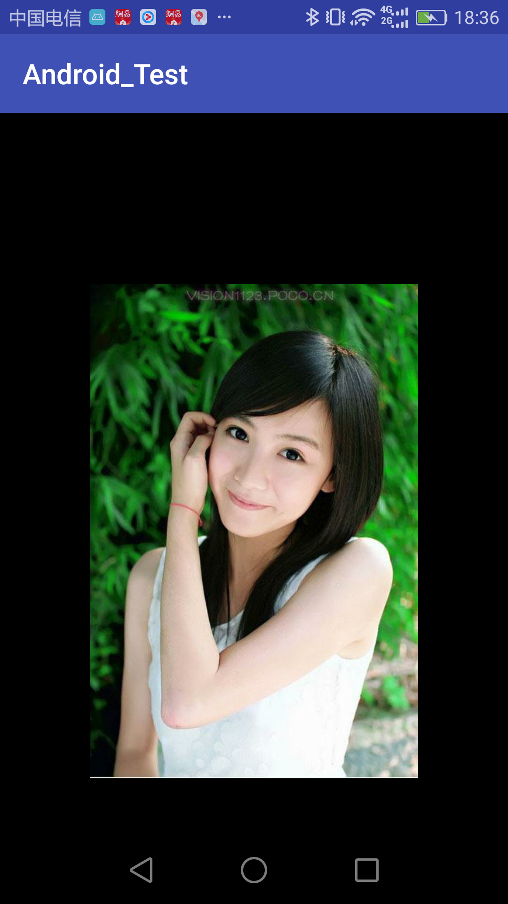
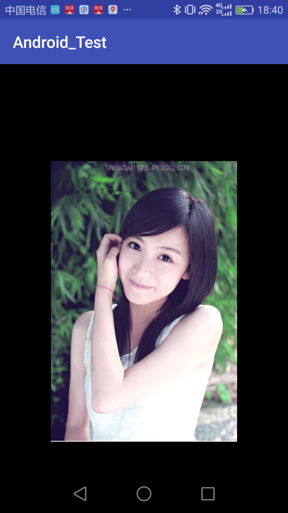
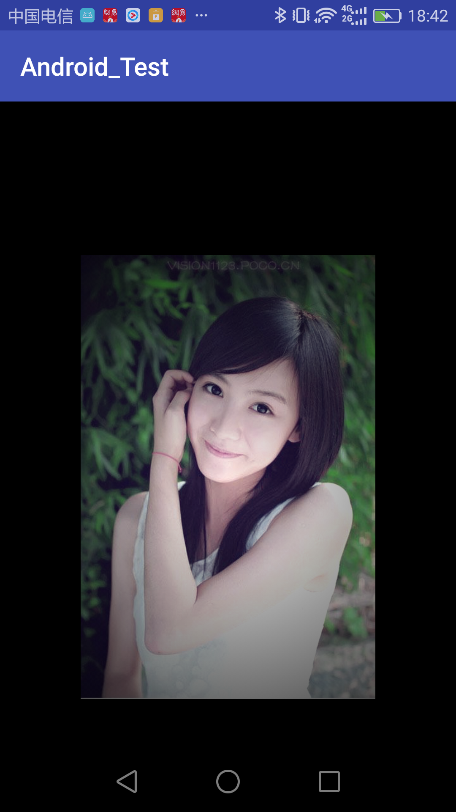

### 学习自：

http://blog.csdn.net/aigestudio/article/details/41799811

### PorterDuff.Mode 的应用

可参考：http://www.jianshu.com/p/d11892bbe055


### 原图


### 去饱和、提亮、色相矫正

```java
// 去饱和、提亮、色相矫正
mBitmapPaint.setColorFilter(new ColorMatrixColorFilter(new float[]{
    0.8587F, 0.2940F, -0.0927F, 0, 6.79F,
    0.0821F, 0.9145F, 0.0634F, 0, 6.79F,
    0.2019F, 0.1097F, 0.7483F, 0, 6.79F,
    0, 0, 0, 1, 0}));
```


### 滤色 PorterDuff.Mode.SCREEN



### 压黑

